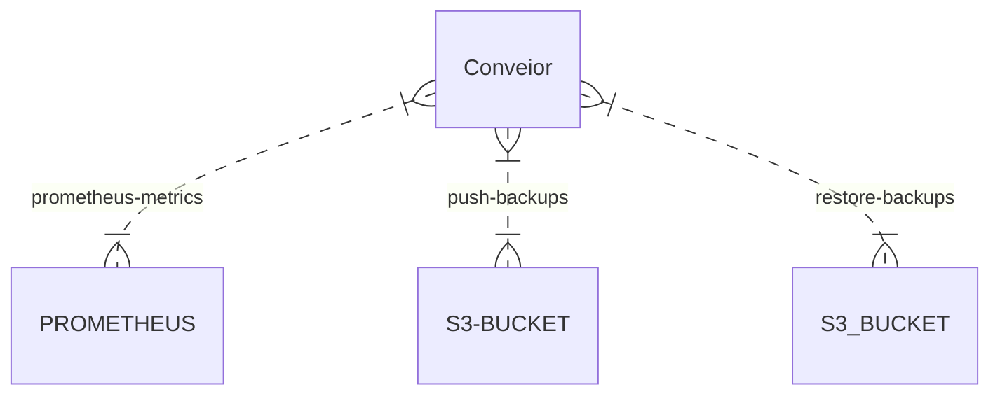

About Conveior
==================

Conveior.io is a DevOps Docker+Kubernetes tool

TLDR: Do you need out of box lightweight solution to back up all of your DB and Stateful Pods? Even Docker containers? Well conveior will convey the backups for You!

- Opensource
- Backup and restore Docker containers or k8s pods (MySQL, Files)
- Custom SQL Metrics (YAML defined custom SQL queries exposing Prometheus metrics)
- https://github.com/lukas-pastva/conveior
- https://hub.docker.com/repository/docker/lukaspastva/conveior

Installation
==================

### Kubernetes Operator
- https://github.com/lukas-pastva/conveior/tree/main/installation-operator
- Install the operator via HELM chart and use CRDs in convinient way

### HELM installation
- using my helm-chartie chart

### ArgoCD installation
- using helm-chartie chart

### Docker installation
- https://github.com/lukas-pastva/conveior/tree/main/installation-docker
- In directory installation-docker there is manual-deploy.sh file to help you to install conveior on your docker server.

### Container runtimes
- by default uses docker, do not forget to share `/var/run/docker.sock`

### Backup features:
- Backing up MySQL pods
- Backing up PostgreSQL pods
- Backing up files inside pods

License
==================
- This is fully OpenSource tool. Do whatever You want with it :-)
- Apache License, Version 2.0, January 2004

Contact
==================

- E-mail: info@lukaspastva.sk

### Usage

