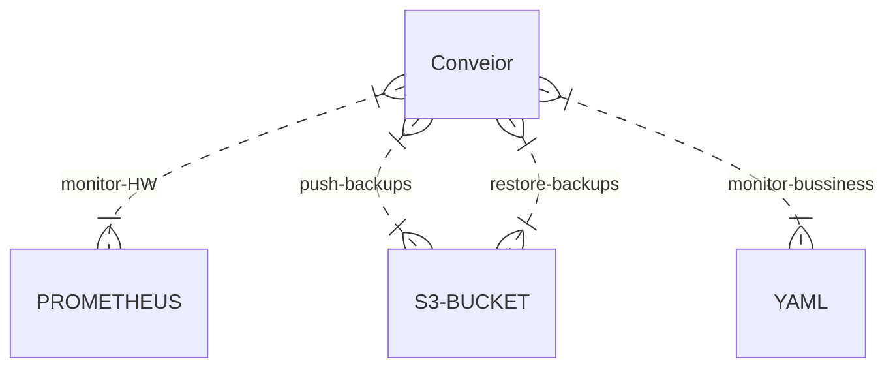

Conveior.io
==================

Conveior.io is a DevOps Docker+Kubernetes tool

- Opensource
- Backup and restore
- Metrics

More info at https://conveior.io

Contact
==================

- E-mail: info@lukaspastva.sk

### Usage


```mermaid
erDiagram
    Conveior }|..|{ PROMETHEUS : monitor-HW
    Conveior }|..|{ S3-BUCKET : push-backups
    Conveior }|..|{ S3-BUCKET : restore-backups
    Conveior }|..|{ YAML : monitor-bussiness
```


### how to S3 PUT
```
contentType="application/x-compressed-tar"
dateValue=`date -R`
resource="/${BUCKET_NAME}/${FILE_S3}"
stringToSign="PUT\n\n${contentType}\n${dateValue}\n${resource}"
signature=`echo -en ${stringToSign} | openssl sha1 -hmac ${S3_SECRET} -binary | base64`
curl -X PUT -T "${FILE_S3}" -H "Date: ${dateValue}" -H "Content-Type: ${contentType}" -H "Authorization: AWS ${S3_KEY}:${signature}" "https://eu2.contabostorage.com/${BUCKET_NAME}/${FILE_S3}"
```

### how to S3 GET
```
contentType="application/x-compressed-tar"
dateValue=`date -R`
resource="/${BUCKET_NAME}/${FILE_S3}"
stringToSign="GET\n\n${contentType}\n${dateValue}\n${resource}"
signature=`echo -en ${stringToSign} | openssl sha1 -hmac ${S3_SECRET} -binary | base64`
curl -H "Date: ${dateValue}" -H "Content-Type: ${contentType}" -H "Authorization: AWS ${S3_KEY}:${signature}" "https://eu2.contabostorage.com/${BUCKET_NAME}/${FILE_S3}"
```

