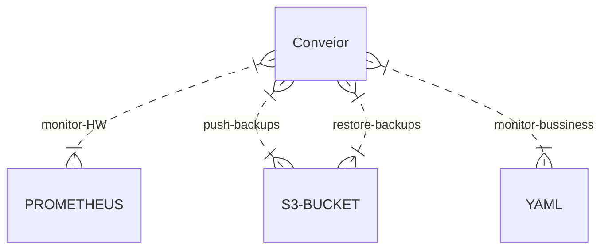

Conveior.io
==================

Conveior.io is a DevOps Docker+Kubernetes tool

- Opensource
- Backup and restore
- Metrics

More info at https://conveior.io

Contact
==================

- E-mail: info@lukaspastva.sk

### Usage


```mermaid
erDiagram
    Conveior }|..|{ PROMETHEUS : monitor-HW
    Conveior }|..|{ S3-BUCKET : push-backups
    Conveior }|..|{ S3-BUCKET : restore-backups
    Conveior }|..|{ YAML : monitor-bussiness
```


### how to s3
```
bucket=tronic
resource="/${bucket}/${file}"
contentType="application/x-compressed-tar"
dateValue=`date -R`
stringToSign="PUT\n\n${contentType}\n${dateValue}\n${resource}"
s3Key=xxx
s3Secret=xxx
signature=`echo -en ${stringToSign} | openssl sha1 -hmac ${s3Secret} -binary | base64`
curl -X PUT -T "${file}" -H "Date: ${dateValue}" -H "Content-Type: ${contentType}" -H "Authorization: AWS ${s3Key}:${signature}" "https://eu2.contabostorage.com/${bucket}/${file}"
```

